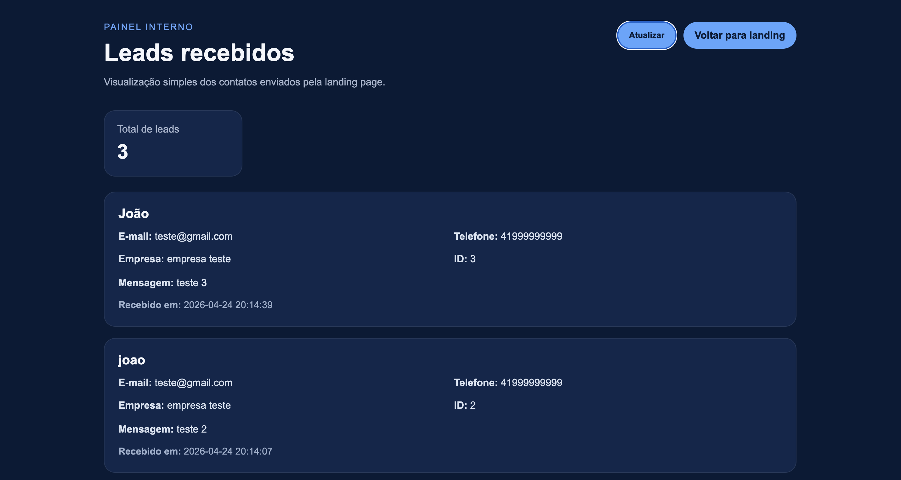

# 💼 Finance Leads Landing (Fullstack)

Landing page moderna para captação de leads com painel administrativo integrado.

---

## 🖼️ Preview do projeto

### 🌐 Landing Page


### 📊 Painel Admin



> 💡 *Dica: adicione prints reais do seu projeto nessa pasta (`frontend/assets`)*

---

## 🌐 Acesse o projeto

🔗 **Landing Page:**
https://finance-leads-landing.vercel.app/

🔗 **Painel Admin (leads):**
https://finance-leads-landing.vercel.app/admin.html

🔗 **API (backend):**
https://finance-leads-backend.onrender.com/leads

---

## 📌 Sobre o projeto

Este projeto simula um fluxo real de captação de leads:

* Usuário preenche formulário na landing page
* Dados são enviados para uma API
* Leads são armazenados em banco de dados
* Painel admin consome a API e exibe os dados

---

## 🚀 Tecnologias utilizadas

### Front-end

* HTML5
* CSS3
* JavaScript

### Back-end

* Node.js
* Express
* SQLite

### Deploy

* Frontend: Vercel
* Backend: Render

---

## 📊 Funcionalidades

### Landing Page

* Formulário de captura de leads
* Feedback de envio (sucesso/erro)
* Tema dark/light com localStorage
* Layout responsivo

### Backend (API REST)

* POST `/leads` → cadastra lead
* GET `/leads` → lista leads
* Validação de dados
* Armazenamento com SQLite

### Painel Admin

* Consumo da API em produção
* Listagem de leads em tempo real
* Contador total de leads
* Atualização manual

---

## ⚙️ Como rodar localmente

### 1. Clone o repositório

```bash
git clone https://github.com/HainerPS/finance-leads-landing.git
```

---

### 2. Backend

```bash
cd backend
npm install
node server.js
```

Acesse:

```bash
http://localhost:3000
```

---

### 3. Frontend

Abra:

```bash
frontend/index.html
```

Ou use Live Server.

---

## 📁 Estrutura do projeto

```bash
finance-leads-landing/
├── backend/
│   ├── server.js
│   ├── database.js
│   ├── database.sqlite
│   └── package.json
│
├── frontend/
│   ├── index.html
│   ├── admin.html
│   ├── script.js
│   ├── admin.js
│   ├── style.css
│   ├── admin.css
│   └── assets/
│       ├── landing-preview.png
│       └── admin-preview.png
│
└── README.md
```

---

## 🧠 Aprendizados

* Integração frontend + backend
* Criação de API REST
* Uso de SQLite
* Deploy (Vercel + Render)
* Consumo de API com fetch
* Tratamento de erros

---

## 🔮 Possíveis melhorias

* Autenticação no admin
* Paginação de leads
* Filtros e busca
* Integração com CRM
* Banco em nuvem (PostgreSQL)

---

## 👨‍💻 Autor

Desenvolvido por **Hainer Soares**
🔗 GitHub: https://github.com/HainerPS
🔗 LinkedIn: https://www.linkedin.com/in/hainer-soares-b4487818b/

---
